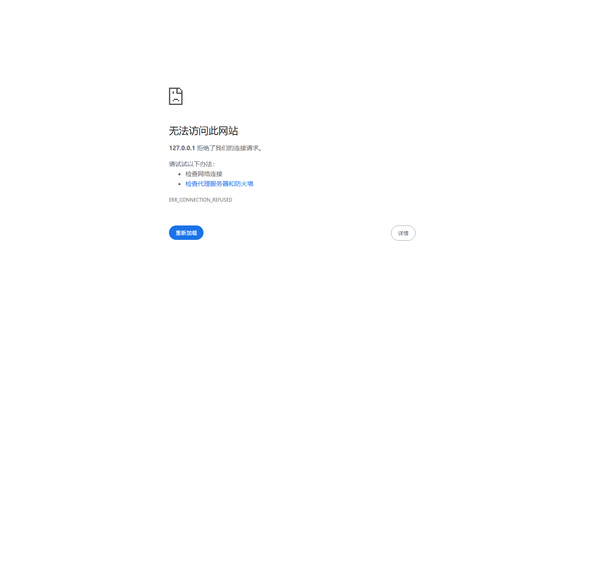
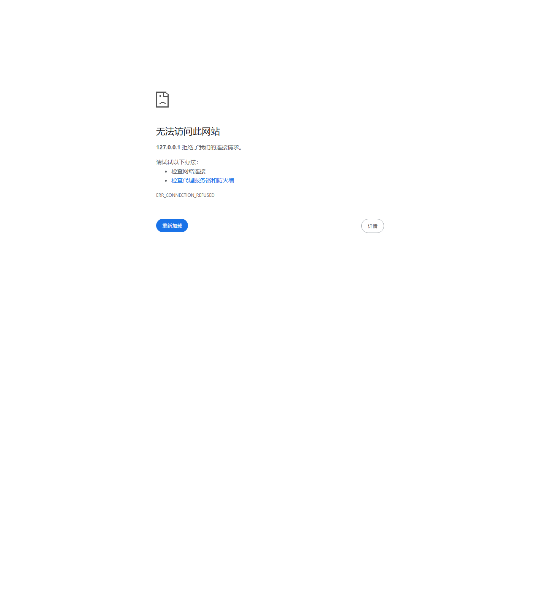
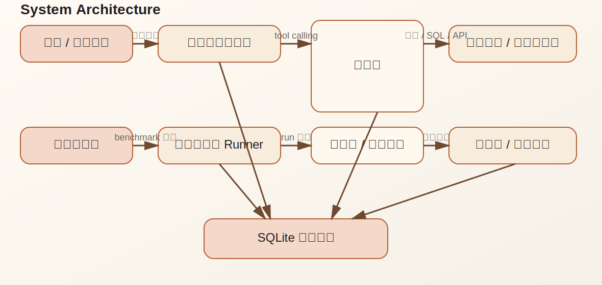
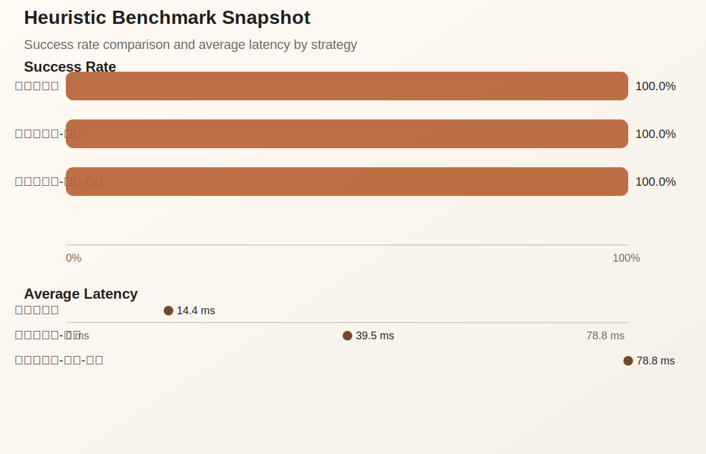

# LLM Agent Evaluation & Optimization Platform

一个面向企业知识库 Agent 的双层项目：

- 上层是在线知识库助手，支持真实提问、会话保存、带引用回答和工具轨迹回放。
- 下层是离线评测与优化平台，复用同一套工具和 runner 做 benchmark、失败分析和策略对比。

这不是普通的聊天 demo，也不是单纯的 RAG 页面。它更接近一个真实 Agent 系统的最小闭环：

1. 用户在在线助手里提问。
2. Agent 调用文档检索、文档读取、SQL、结构化 case API、计算器等工具。
3. 系统记录完整执行轨迹、引用、时延、token 和成本估算。
4. 同一套能力再被离线 benchmark 复用，用于比较不同策略与模型配置。

界面默认使用中文。

## Screenshots

### Dashboard



### Assistant



### Experiment Detail


## Architecture



这个系统分成两层：

- 在线层负责真实问答与会话体验。
- 离线层负责 benchmark、评分、失败归因和策略优化。

两层共用：

- 文档与结构化数据
- 工具层
- Agent runner
- SQLite 持久化

## Benchmark Snapshot



当前内置 benchmark 由 3 种启发式策略构成：

- `baseline_tool_calling`
- `planner_executor`
- `planner_executor_verifier`

默认 benchmark 基于本地文档快照和本地任务集，不依赖实时联网结果，所以实验可复现。

## Why This Project

这个项目主要解决两个问题：

1. 如何做一个最小可落地的企业知识库 Agent。
2. 如何用统一实验框架评估和优化 Agent 的效果、稳定性和成本。


## Key Features

### 在线知识库助手

入口：

- `/assistant`
- `/assistant/{session_id}`

能力：

- 支持真实提问与会话保存
- 支持切换不同 Agent 配置
- 优先使用 live model 配置
- live model 不可用时自动回退到本地确定性检索回答
- 每条回答都保留：
  - `chunk_id` 引用
  - 执行轨迹
  - 总时延
  - token 估算
  - 成本估算

### 离线评测平台

入口：

- `/`
- `/experiments`
- `/experiments/{experiment_id}`
- `/leaderboard`
- `/runs/{run_id}`
- `/failures`

能力：

- 固定 benchmark 数据集
- 任务组 / 配置组预设切片
- 批量实验执行
- 聚合指标统计
- 失败类型分析
- 单条 run 轨迹回放

## Benchmark Design

### 文档语料

当前内置 3 份本地文档快照：

- `FastAPI`
- `SQLite`
- `DashScope / Qwen`

语料目录：

- [`agent_eval/assets/corpus`](agent_eval/assets/corpus)

### 任务集

共 50 个种子任务：

- 25 个单跳问答任务
- 15 个多步工具调用任务
- 10 个故障恢复任务

种子定义位于：

- [`agent_eval/seed.py`](agent_eval/seed.py)

### 工具层

当前支持 6 个工具：

- `doc_search`
- `doc_read`
- `sql_query`
- `case_api`
- `calculator`
- `web_lookup`

实现位于：

- [`agent_eval/tools.py`](agent_eval/tools.py)

### 策略层

当前核心策略：

- `baseline_tool_calling`
- `planner_executor`
- `planner_executor_verifier`

启发式与实时模型 runner 位于：

- [`agent_eval/runners.py`](agent_eval/runners.py)

## Metrics

每次 run 记录：

- tool 调用顺序
- tool 参数与输出
- step 级 thought / observation
- citations
- total latency
- total tokens
- total cost estimate
- rule-based evaluation

当前核心聚合指标：

- `success_rate`
- `avg_latency_ms`
- `avg_tokens`
- `avg_cost`
- `tool_error_rate`
- `invalid_action_rate`
- `recovery_rate`
- `avg_steps`

失败类型：

- `wrong_retrieval`
- `bad_tool_choice`
- `tool_error_not_recovered`
- `format_violation`
- `hallucinated_answer`

评测器位于：

- [`agent_eval/evaluator.py`](agent_eval/evaluator.py)

## Tech Stack

- Python
- FastAPI
- Pydantic
- SQLite + FTS5
- Jinja2 Templates
- Plotly
- Ollama / DashScope OpenAI-compatible API

配置文件：

- [`pyproject.toml`](pyproject.toml)
- [`agent_eval/config.py`](agent_eval/config.py)
- [`.env.example`](.env.example)

## Project Structure

```text
agent_eval/
  assets/corpus/        Local documentation snapshots
  assistant.py          Online knowledge-base assistant service
  cli.py                Seed and benchmark commands
  config.py             Environment-driven settings
  evaluator.py          Rule-based evaluator
  experiments.py        Experiment orchestration and aggregation
  llm.py                DashScope / Ollama OpenAI-compatible client
  models.py             Schemas for tasks, runs, sessions, and evaluation
  presets.py            Benchmark task/config presets
  runners.py            Heuristic and live-model runners
  seed.py               Corpus, task, and config seed data
  storage.py            SQLite schema and persistence
  tools.py              Tool registry and fault injection
  utils.py              JSON / token / cost / FTS helpers
  web.py                FastAPI app
  templates/            Chinese server-rendered templates
  static/               Styles
docs/images/            README assets
scripts/                Asset generation helpers
tests/
```

## Quick Start

### 1. Install dependencies

```bash
python -m pip install -e .[dev]
```

### 2. Seed demo data

```bash
python -m agent_eval.cli seed-demo
```

### 3. Run a benchmark

```bash
python -m agent_eval.cli run-benchmark
```

### 4. Start the web app

```bash
python -m uvicorn agent_eval.web:app --reload
```

Windows 下推荐从项目目录启动：

```powershell
cd "J:\ide-workspace\新建文件夹"
python -m uvicorn agent_eval.web:app --reload --reload-dir "J:\ide-workspace\新建文件夹\agent_eval"
```

打开：

- `http://127.0.0.1:8000/assistant`
- `http://127.0.0.1:8000/`
- `http://127.0.0.1:8000/experiments`
- `http://127.0.0.1:8000/leaderboard`
- `http://127.0.0.1:8000/failures`

## CLI

初始化数据库：

```bash
python -m agent_eval.cli init-db
```

重新灌种子：

```bash
python -m agent_eval.cli seed-demo
```

运行完整 benchmark：

```bash
python -m agent_eval.cli run-benchmark
```

按预设切片运行：

```bash
python -m agent_eval.cli run-benchmark --task-preset single_hop --config-preset heuristic --limit 5
python -m agent_eval.cli run-benchmark --task-preset recovery --config-preset ollama_live --limit 3
```

追加显式任务 / 配置：

```bash
python -m agent_eval.cli run-benchmark --task-id TASK-SH-001 --config-id baseline_heuristic
```

支持的任务预设：

- `all`
- `single_hop`
- `multi_step`
- `recovery`

支持的配置预设：

- `all`
- `heuristic`
- `dashscope_live`
- `ollama_live`

## Web Routes

### Online assistant

- `GET /assistant`
- `GET /assistant/{session_id}`
- `POST /assistant/ask`

### Evaluation platform

- `GET /`
- `POST /experiments/run`
- `GET /experiments`
- `GET /experiments/{experiment_id}`
- `GET /leaderboard`
- `GET /runs/{run_id}`
- `GET /tasks`
- `GET /failures`

HTML 页面支持 `?format=json` 返回 JSON。

## Using qwen3.5:9b with Ollama

如果你本地已经装好了 Ollama 并拉取了 `qwen3.5:9b`，可以这样启用：

```powershell
$env:AGENT_EVAL_INCLUDE_LIVE_OLLAMA_CONFIGS="true"
$env:AGENT_EVAL_OLLAMA_BASE_URL="http://127.0.0.1:11434/v1"
$env:AGENT_EVAL_OLLAMA_API_KEY="ollama"
$env:AGENT_EVAL_PLANNER_MODEL="qwen3.5:9b"
$env:AGENT_EVAL_EXECUTOR_MODEL="qwen3.5:9b"
$env:AGENT_EVAL_VERIFIER_MODEL="qwen3.5:9b"

python -m agent_eval.cli seed-demo
```

启用后会增加 3 个实时配置：

- `Ollama 实时基线`
- `Ollama 实时规划-执行`
- `Ollama 实时规划-执行-校验`

在线助手会优先使用实时配置；如果实时模型调用失败，会自动回退到本地确定性检索回答。

## DashScope

```powershell
$env:AGENT_EVAL_DASHSCOPE_API_KEY="your_key"
$env:AGENT_EVAL_INCLUDE_LIVE_QWEN_CONFIGS="true"
$env:AGENT_EVAL_PLANNER_MODEL="qwen-plus"
$env:AGENT_EVAL_EXECUTOR_MODEL="qwen-plus"
$env:AGENT_EVAL_VERIFIER_MODEL="qwen-max"

python -m agent_eval.cli seed-demo
```

## Generate README Assets

生成架构图和 benchmark 结果图：

```bash
python scripts/generate_readme_assets.py
```

当前仓库中的截图来自本地运行中的应用页面，位于：

- [`docs/images/screenshots`](docs/images/screenshots)

## Why This Project Is Resume-Friendly

一个更强的项目表述方式是：

> 我实现了一个企业知识库 Agent，并设计了配套的离线评测与优化平台。在线层负责真实问答、工具调用和带引用回答；离线层负责统一 benchmark、记录轨迹、分析失败并比较不同策略在成功率、时延、成本和恢复能力上的差异。

这个表达比“做了一个 AI 助手”更有信息量，也更贴近 Agent 工程岗位。

## Verified Locally

本地已验证：

- `python -m pytest`
- benchmark 预设可运行
- 中文页面可正常渲染
- `/assistant/ask` 可创建会话并返回带引用回答
- `CASE-001` 场景可结合 case API、SQL 和文档检索生成回答

## Roadmap

如果继续往“更像真实产品”推进，优先级建议是：

1. 把在线会话中的失败样本一键转成 benchmark 候选任务。
2. 接真实文档目录导入，而不是只用种子快照。
3. 增加人工反馈和简单质量标注。
4. 增加实验对比导出页，用于写报告或简历素材。
5. 接权限与用户体系，把助手做成真正的内部工具。

## Tests

```bash
python -m pytest
```

推荐在提交前执行：

```bash
python -m pytest
python -m agent_eval.cli seed-demo
python -m agent_eval.cli run-benchmark --task-preset single_hop --config-preset heuristic --limit 3
```
